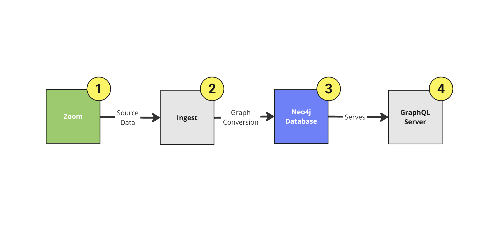

# Zoom to Neo4j Ingest Function

This application is for running a Google Cloud/Run Function that will ingest Zoom profile data into a Neo4j database.



This is the `Ingest` component of the above workflow.

## Required Neo4j Constraints

See the `neo4j_constraints.md` for the Cypher commands to enable required contraints in the target Neo4j instance for this data ingestion

## Local Running

In CLI, run:

```
poetry update
```

Then:

```
NEO4J_URI=bolt://localhost:7687 \
NEO4J_USERNAME=neo4j \
NEO4J_PASSWORD=<password> \
poetry run functions-framework --target=ingest --port=8000
```

Optionally enable basic auth with:

```
NEO4J_URI=bolt://localhost:7687 \
NEO4J_USERNAME=neo4j \
NEO4J_PASSWORD=<password> \
BASIC_AUTH_USER=zoom \
BASIC_AUTH_PASSWORD=faster_together \
poetry run functions-framework --target=ingest --port=8000
```

# GraphQL Toolbox

Use the [Neo4j GraphQL Toolbox](https://graphql-toolbox.neo4j.io/) to explore or generate a GraphQL schema from the imported data.
